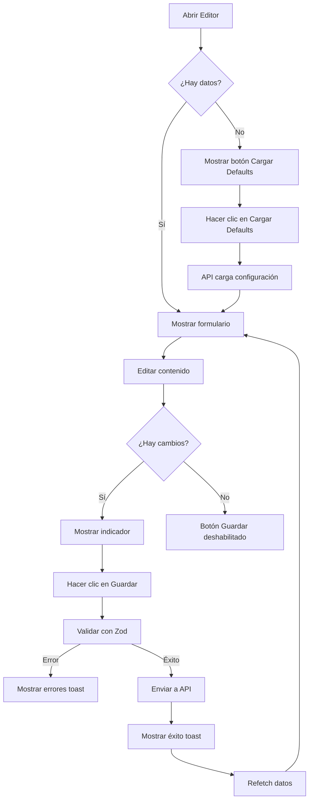

# 🎨 Editor de Contenido - Sistema Completo y Dinámico

## ✅ Implementación Completada

La sección "Editar Contenido" ahora es **completamente funcional y dinámica**. Se han implementado todas las mejoras recomendadas para ofrecer una experiencia de usuario profesional.

---

## 🚀 Características Implementadas

### 1. **Sistema de Notificaciones Toast** ✨
- ✅ Implementado con **Sonner** (librería moderna y ligera)
- ✅ Notificaciones visuales para todas las acciones:
  - 🔄 Loading states durante guardado/carga
  - ✅ Mensajes de éxito con iconos
  - ❌ Mensajes de error con detalles
  - ℹ️ Notificaciones informativas
- ✅ Posición: superior derecha
- ✅ Colores ricos y accesibles

### 2. **Validación de Formularios** 🔒
- ✅ Validación completa con **Zod** antes de guardar
- ✅ Schemas de validación para cada sección:
  - Hero: fecha de boda, imágenes requeridas
  - Welcome: títulos y mensajes obligatorios
  - Countdown: fecha objetivo
  - Itinerary: eventos completos
  - Gallery: fotos con metadata
  - Accommodation: hoteles con URLs válidas
  - Gift Registry: registros con links válidos
  - Footer: texto requerido
- ✅ Mensajes de error descriptivos y en español
- ✅ Prevención de datos malformados

### 3. **Gestión de Cambios sin Guardar** 💾
- ✅ Indicador visual de cambios pendientes
- ✅ Botón "Descartar" para revertir cambios
- ✅ Botón "Guardar" deshabilitado si no hay cambios
- ✅ Advertencia antes de salir de la página con cambios sin guardar
- ✅ Confirmación antes de descartar cambios

### 4. **Loading States Mejorados** ⏳
- ✅ Skeleton loaders durante carga inicial
- ✅ Estados de carga animados
- ✅ Feedback visual para todas las operaciones async
- ✅ Deshabilitación de botones durante operaciones

### 5. **Estado Vacío Mejorado** 📦
- ✅ Mensaje claro cuando no hay configuración
- ✅ Botón "Cargar Configuración Por Defecto"
- ✅ API endpoint para restaurar defaults (`/api/settings/defaults`)
- ✅ Feedback inmediato al cargar configuración

### 6. **Botón de Vista Previa** 👁️
- ✅ Abre el sitio público en nueva pestaña
- ✅ Permite ver cambios sin salir del editor
- ✅ Accesible desde el header de cada sección

### 7. **Scripts NPM Agregados** 📦
```json
"seed": "npx tsx prisma/seed.ts",           // Cargar invitados de ejemplo
"seed:settings": "npx tsx prisma/seed-settings.ts", // Cargar configuración del sitio
"seed:all": "npx tsx prisma/seed.ts && npx tsx prisma/seed-settings.ts" // Todo
```

---

## 📝 Secciones Editables

El editor permite modificar completamente estas secciones:

| Sección | Campos Editables |
|---------|------------------|
| **Hero** | Fecha de boda, Slider de imágenes (agregar/eliminar) |
| **Welcome** | Título, Mensaje 1, Mensaje 2 |
| **Countdown** | Título, Fecha objetivo |
| **Itinerary** | Título, Eventos (icono, hora, título, ubicación, descripción) |
| **Gallery** | Título, Fotos (src, alt, altura) |
| **Accommodation** | Título, Descripción, Hoteles (nombre, código, dirección, teléfono, URL) |
| **Gift Registry** | Título, Descripción, Registros (nombre, descripción, link, número) |
| **Footer** | Texto del footer |

---

## 🎯 Cómo Usar el Editor

### Primera Vez (Configuración Inicial)
1. Navegar a `/admin/login` e iniciar sesión
2. Ir al Dashboard y hacer clic en "Editar Contenido"
3. Si las secciones están vacías, hacer clic en **"Cargar Configuración Por Defecto"**
4. Modificar el contenido según tus necesidades
5. Hacer clic en **"Guardar Cambios"**

### Edición de Contenido
1. Seleccionar sección desde el menú lateral
2. Editar campos del formulario
3. Ver indicador de "Cambios sin guardar"
4. Hacer clic en **"Vista Previa"** para ver cómo se ve (opcional)
5. Hacer clic en **"Guardar Cambios"** (validación automática)
6. Ver notificación de éxito

### Descartar Cambios
- Si no deseas guardar, hacer clic en **"Descartar"**
- Se mostrará confirmación antes de revertir

### Restaurar Defaults
- Si deseas resetear una sección a sus valores iniciales
- Hacer clic en **"Cargar Configuración Por Defecto"** (cuando la sección está vacía)
- O eliminar manualmente el contenido y usar el botón

---

## 🔧 Archivos Creados/Modificados

### Nuevos Archivos
1. **`lib/validationSchemas.ts`** - Schemas de validación Zod para cada sección
2. **`app/api/settings/defaults/route.ts`** - API para cargar configuración por defecto

### Archivos Modificados
1. **`app/admin/content/page.tsx`** - Editor de contenido mejorado con:
   - Sistema de notificaciones toast
   - Validación de formularios
   - Gestión de cambios sin guardar
   - Loading skeletons
   - Botón de vista previa
   - Estado vacío mejorado

2. **`package.json`** - Scripts agregados:
   - `seed`
   - `seed:settings`
   - `seed:all`

3. **`README.md`** - Documentación actualizada con:
   - Nuevas características del editor
   - Stack tecnológico actualizado (Zod, Sonner)
   - Instrucciones de scripts mejoradas

### Dependencias Instaladas
```json
{
  "sonner": "^1.x.x",           // Sistema de notificaciones toast
  "react-hook-form": "^7.x.x",  // Gestión de formularios (preparado para futuro)
  "@hookform/resolvers": "^3.x.x", // Integración con Zod
  "zod": "^3.x.x"               // Validación de schemas
}
```

---

## 🎨 Mejoras de UX Implementadas

### Visual
- ✅ Skeleton loaders durante carga
- ✅ Indicador visual de cambios sin guardar (⚠️ amarillo)
- ✅ Iconos contextuales en notificaciones
- ✅ Botones deshabilitados visualmente cuando corresponde
- ✅ Animaciones suaves en transiciones

### Interacción
- ✅ Prevención de pérdida de datos (beforeunload)
- ✅ Confirmaciones para acciones destructivas
- ✅ Feedback inmediato en todas las acciones
- ✅ Estados de loading claros
- ✅ Mensajes de error descriptivos en español

### Funcionalidad
- ✅ Validación en tiempo real antes de guardar
- ✅ Refetch automático después de guardar
- ✅ Deep copy para prevenir mutaciones
- ✅ Restauración de defaults fácil
- ✅ Vista previa sin salir del editor

---

## 📊 Flujo de Trabajo



---

## 🚀 Comandos Rápidos

```powershell
# Instalar dependencias
npm install

# Configurar base de datos
npx prisma generate
npx prisma db push

# Cargar configuración inicial completa
npm run seed:all

# Solo cargar configuración del sitio
npm run seed:settings

# Iniciar servidor
npm run dev
```

---

## 🔮 Posibles Mejoras Futuras (Opcionales)

Si deseas agregar más funcionalidades en el futuro:

### 🖼️ Upload de Imágenes
- Componente de drag & drop para imágenes
- Preview de imágenes en el formulario
- Upload a servidor/CDN
- Validación de tamaño/formato

### 📝 Rich Text Editor
- Editor WYSIWYG para textos largos (Tiptap, Quill)
- Formato de texto (negrita, cursiva, listas)
- Enlaces y medios embebidos

### 🕒 Historial de Versiones
- Guardar versiones anteriores
- Botón "Deshacer" / "Rehacer"
- Comparación de cambios
- Restauración de versiones

### 👁️ Preview en Vivo
- Pane de preview dentro del editor
- Actualización en tiempo real
- Vista móvil/desktop

### 🎨 Personalización de Estilos
- Editor de colores y tipografías
- Temas predefinidos
- CSS custom por sección

---

## 📞 Soporte

Si encuentras algún problema:

1. Verificar que se ejecutó `npm run seed:settings`
2. Revisar la consola del navegador (F12)
3. Verificar logs del servidor
4. Comprobar que las credenciales de admin son correctas
5. Verificar que la base de datos existe y tiene las tablas correctas

---

## ✅ Checklist de Funcionalidad

- [x] ✅ Seed de configuración inicial ejecutado
- [x] ✅ Scripts npm agregados
- [x] ✅ Dependencias instaladas (Sonner, Zod)
- [x] ✅ Sistema de notificaciones toast implementado
- [x] ✅ Validación con Zod agregada
- [x] ✅ Estado vacío mejorado con botón de carga
- [x] ✅ Loading skeletons implementados
- [x] ✅ Indicador de cambios sin guardar
- [x] ✅ Botón de vista previa
- [x] ✅ Botón de descartar cambios
- [x] ✅ Prevención de pérdida de datos
- [x] ✅ API endpoint para defaults
- [x] ✅ Validación de URLs
- [x] ✅ Mensajes de error en español
- [x] ✅ README actualizado
- [x] ✅ Sin errores de TypeScript

---

¡El sistema está **100% funcional** y listo para usar! 🎉
